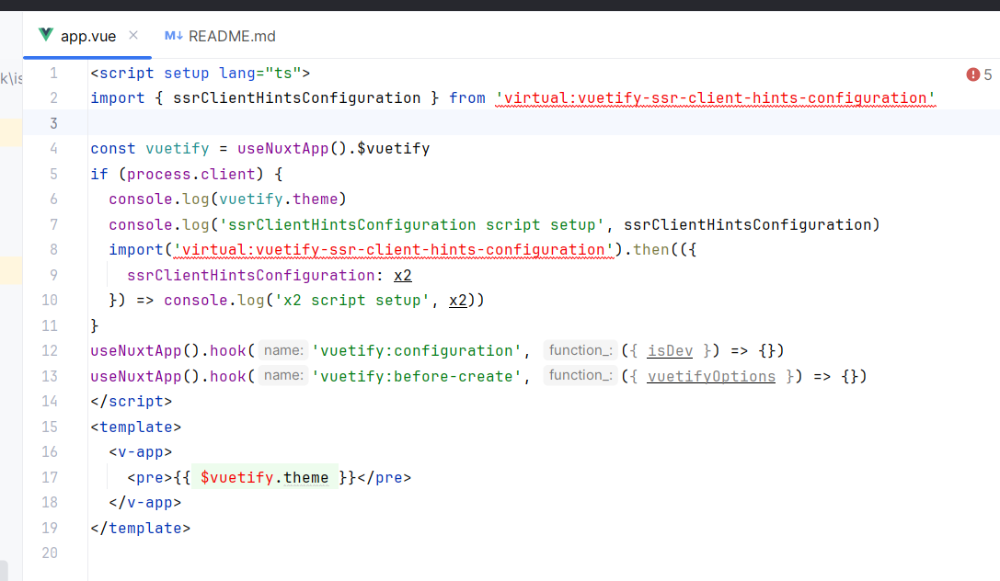
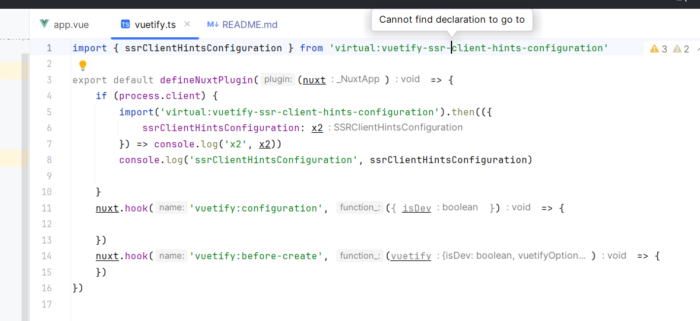

# Checking Vuetify Nuxt Module Augmentation

This repo is using `pnpm` as package manager with a local tgz of `vuetify-nuxt-module` via `file:` protocol: the tgz has been created from the following PR https://github.com/userquin/vuetify-nuxt-module/pull/156.

It seems there are some issues with the Vuetify Nuxt module augmentation when using VS Code or JetBrains IDE.

This repo checks the behavior for:
- Nuxt configuration
- custom Vuetify configuration file
- module hooks
- runtime hooks and Vuetify augmentation (`$vuetify` inside Vue SFC, and script setup and Nuxt Plugins via `useNuxtApp()`)
- virtual modules.

Running `pnpm nuxt prepare && vue-tsc --noEmit` works, there are no errors.

You can switch between `Node10` and `Bundler`, update the `nuxt.config.ts` file switching `experimental.typescriptBundlerResolution` and running `pnpm nuxt prepare`, maybe you also need to restart the window (VS Code) or Vue Language Server or reopen the IDE/Project (IntelliJ/WebStorm).

**NOTE**:
- after initial installation `pnpm install`, IntelliJ/WebStorm can take some time to index the project dependencies
- you can find the `tsconfig.json` config file in the `.nuxt` folder after initial installation or running `pnpm nuxt prepare`

**NOTES For Nuxt**: 
- importing the module from the `modules` folder seems to work (also using `~/modules/vuetify`), if we remove it, then the module hook is not resolved properly!
- we should review `module-builder`, on IntelliJ UE/Beta 3, `Ctrl + Click` on `unocss:config` module hook goes to the declaration, the UnoCSS Nuxt package using `unbuild` to build the module.

https://streamable.com/5qdx8g

### VS Code

- Configuration (nuxt.config.ts):
  - ✔️ `vuetify` resolves to `module:nuxt/schema.NuxtConfig.vuetify?: Partial<O> | Record<string, any>`
  - ✔️ types are ok with `Ctrl + Mouse Over`
  - ✔️ `Ctrl + Mouse Click` on any entry goes to the definition
- Custom configuration (vuetify.config.ts):
  - ✔️ `defineVuetifyConfiguration` resolves, `Ctrl + Mouse Click` goes to the definition
  - ✔️ `Ctrl + Mouse Click` on the import goes to the definition
- Vue SFC template (app.vue):
  - ✔️ `$vuetify` resolves
  - ✔️ `Ctrl + Mouse Click` goes to the definition
- Vue SFC script setup (app.vue):
  - ✔️ `useNuxtApp().$` shows all module augmentations (provide/inject)
  - ✔️ `Ctrl + Mouse Over` on `useNuxtApp().$vuetify` shows type
  - ✔️ `Ctrl + Mouse Over` on the `vuetify` variable in `const vuetify = useNuxtApp().$vuetify` shows type
  - ✔️ `Ctrl + Mouse Click` on `useNuxtApp().$vuetify` goes to the definition
  - ❌ `Ctrl + Mouse Click` on the vuetify variable in `const vuetify = useNuxtApp().$vuetify` doesn't go to the definition
- Runtime Hooks (app.vue & plugins/vuetify.ts):
  - ✔️ `useNuxtApp().hook('` shows all runtime hooks (Vue SFC script setup and plugins)
  - ✔️ `useNuxtApp().hook` resolves parameter types
  - ✔️ `Ctrl + Mouse Over` on any `useNuxtApp().hook` parameter types shows definition
  - ❌ `Ctrl + Mouse Click` on `useNuxtApp().hook` hook name doesn't go to the definition
  - ✔️ `Ctrl + Mouse Click` on any `useNuxtApp().hook` parameter types goes to the definition
- Module Hooks (modules/vuetify.ts):
  - ✔️ `nuxt.hook('` shows the Vuetify module hook
  - ✔️ `vuetify:registerModule` hook resolves parameter types properly
  - ✔️ `Ctrl + Mouse Over` on any `nuxt.hook` parameter types shows definition
  - ❌ `Ctrl + Mouse Click` on `nuxt.hook` hook name doesn't go to the definition
  - ❌ `Ctrl + Mouse Click` on any `nuxt.hook` parameter types doesn't go to the definition
- Virtual Modules (app.vue & plugins/vuetify.ts)
  - ✔️ resolves static import in Vue SFC script setup
  - ✔️ resolves static import in TypeScrypt
  - ✔️ `Ctrl + Mouse Click` on `virtual:vuetify-ssr-client-hints-configuration` goes to the definition in both cases
  - ✔️ `Ctrl + Mouse Over` on the named import shows the type in both cases
  - ✔️ `Ctrl + Mouse Click` on the named import goes to the definition in both cases

### IntelliJ Ultimate Edition and Beta 3 (EAP)

- Configuration (nuxt.config.ts): 
  - ❌ `vuetify` resolves to `module:nuxt/schema.NuxtConfig.vuetify?: Partial<O> | Record<string, any>`
  - ✔️ types are ok with `Ctrl + Mouse Over`
  - ❌ `Ctrl + Mouse Click` on any entry doesn't go to the definition
- Custom configuration (vuetify.config.ts):
  - ✔️ `defineVuetifyConfiguration` resolves, `Ctrl + Mouse Click` goes to the definition
  - ❌ `Ctrl + Mouse Click` on the import doesn't go to the definition
- Vue SFC template (app.vue): 
  - ❌ `$vuetify` doesn't resolve (it is red in the editor)
  - ❌ `Ctrl + Mouse Click` doesn't go to the definition
- Vue SFC script setup (app.vue): 
  - ✔️ `useNuxtApp().$` shows all module augmentations (provide/inject)
  - ✔️ `Ctrl + Mouse Over` on `useNuxtApp().$vuetify` shows type
  - ✔️ `Ctrl + Mouse Over` on the `vuetify` variable in `const vuetify = useNuxtApp().$vuetify` shows type
  - ❌ `Ctrl + Mouse Click` on `useNuxtApp().$vuetify` doesn't go to the definition
  - ❌ `Ctrl + Mouse Click` on the vuetify variable in `const vuetify = useNuxtApp().$vuetify` doesn't go to the definition
- Runtime Hooks (app.vue & plugins/vuetify.ts):
  - ✔️ `useNuxtApp().hook('` shows all runtime hooks (Vue SFC script setup and plugins)
  - ✔️ `useNuxtApp().hook` resolves parameter types
  - ✔️ `Ctrl + Mouse Over` on any `useNuxtApp().hook` parameter types shows definition
  - ❌ `Ctrl + Mouse Click` on `useNuxtApp().hook` hook name doesn't go to the definition
  - ❌ `Ctrl + Mouse Click` on any `useNuxtApp().hook` parameter types doesn't go to the definition
- Module Hooks (modules/vuetify.ts):
  - ✔️ `nuxt.hook('` shows the Vuetify module hook
  - ✔️ `vuetify:registerModule` hook resolves parameter types properly
  - ✔️ `Ctrl + Mouse Over` on any `nuxt.hook` parameter types shows definition
  - ❌ `Ctrl + Mouse Click` on `nuxt.hook` hook name doesn't go to the definition
  - ❌ `Ctrl + Mouse Click` on any `nuxt.hook` parameter types doesn't go to the definition
- Virtual Modules (app.vue & plugins/vuetify.ts)
  - ❌ cannot resolve static import, doesn't work in Vue SFC script setup (it is in read)
  - ❌ cannot resolve static import, doesn't work in TypeScrypt (it is not in read)
  - ❌ `Ctrl + Mouse Click` on `virtual:vuetify-ssr-client-hints-configuration` doesn't go to the definition in both cases
  - ❌ `Ctrl + Mouse Over` on the named import doesn't show the type in both cases (works when using `Bundler`)
  - ❌ `Ctrl + Mouse Click` on the named import doesn't go to the definition in both cases

#### IntelliJ Ultimate Edition Screenshots

